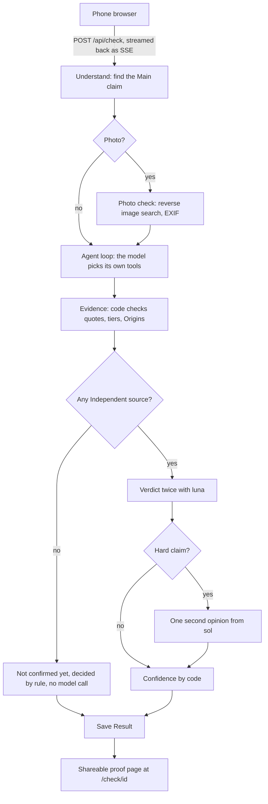

# TruthAgent

**Paste a forward. Get a plain answer, with the proof.**

TruthAgent checks whether what people forward is true: a WhatsApp message, a screenshot of a
"news" headline, or a photo with a dramatic caption. It answers in plain language that anyone
can read, **True, False, Misleading, Outdated or Not confirmed yet**, and shows how it got
there: quoted Evidence with links and dates, For and Against side by side, a Confidence level
with its reason in words, and a shareable proof page to send back to the family group.

Built for **Binary Hacks 4.0, problem statement PS-05**: an autonomous, multimodal agent that
accepts text, images or both, finds the factual Claims, splits them into verification tasks,
searches credible sources, weighs supporting against contradicting Evidence, and gives an
explainable Verdict with Evidence, citations, Confidence and reasoning.

---

## Contents

- [Why it exists](#why-it-exists)
- [What the user sees](#what-the-user-sees)
- [The answers it gives](#the-answers-it-gives)
- [How a Check works](#how-a-check-works)
- [The rules that make it trustworthy](#the-rules-that-make-it-trustworthy)
- [Tech stack](#tech-stack)
- [Models and budget](#models-and-budget)
- [Getting started](#getting-started)
- [Replay and live modes](#replay-and-live-modes)
- [Testing](#testing)
- [Project layout](#project-layout)
- [Status and roadmap](#status-and-roadmap)
- [Contributing](#contributing)
- [Further reading](#further-reading)

---

## Why it exists

People in India receive forwards all day, and most of them aren't technical. Checking a
forward by hand means searching several sites, judging which ones to trust, and noticing
dates. That takes time and skill most people don't have.

General chatbots don't solve this well:

- their answer stays in a private chat and **can't be sent back to the group**;
- they **change between runs**;
- they rarely ask **"true as of when?"**, so a claim that was true last year gets the wrong answer;
- they don't trace **where a photo first appeared**;
- they tend to **agree with how the question is framed**;
- they don't know **which Indian sources settle which kind of claim**: the family for a death,
  RBI for currency, the Election Commission for results.

TruthAgent is built around those gaps.

## What the user sees

One page, one box, one button, designed for a phone first.

1. **Input page.** Paste the forward (up to 2,000 characters), press **Check if it's true**.
2. **Live steps.** While TruthAgent works, each step appears as it happens:
   *Found the claim…*, *Searching the web for "…"*, *Reading rbi.org.in…*,
   *Kept a quote from thehindu.com (against the claim)*, *Verdict ready*.
3. **Proof page** (`/check/<id>`), a public link that works without logging in:
   - the **Verdict** in large type, with a one-line reason;
   - **Confidence** (High, Medium or Low) with the reason in words, for example
     *"2 Independent sources agree, 1 of them official"*;
   - the **Main claim** as it was written;
   - **Why**: reasoning steps, each tagged *Fact*, *Inference*, *Assumption* or *Hypothesis*,
     and linked to the Evidence it relies on (E1, E2…);
   - **What would change this Verdict**;
   - which model decided, or that a rule decided;
   - **Evidence** in **For** and **Against** columns: each item has the quote, a link, the
     site's trust tier, the date, and its Origin;
   - **What TruthAgent did**: the agent's steps as they were shown live.

**Photos and screenshots:** add a photo or screenshot as well as, or instead of, text. The text
in a screenshot is read and checked. A separate **Photo check** says whether the photo is real,
where and when it first appeared, and what the photo file says about itself (date, camera,
place). It is never a bare "FAKE", and it's kept apart from the Verdict, because **a real photo
can carry a false story**. A photo with no text gets a Photo check and a nudge to paste the
message that came with it.

## The answers it gives

| Verdict | Meaning | Example |
|---|---|---|
| **True** | The Evidence backs the core of the Claim. | "RBI has withdrawn ₹2000 notes from circulation" |
| **False** | The core of the Claim was never true. | "Amitabh Bachchan has died" (a recurring hoax) |
| **Misleading** | The facts are right, but the framing or conclusion is wrong. | — |
| **Outdated** | The Claim was true at an earlier date and isn't as of its Claim date. | *planned, #9* |
| **Not confirmed yet** | Too few Independent sources either way. The honest answer during a developing story. | "Actor admitted to hospital in critical condition" |

**Confidence** is separate from the label. It says how strongly the Evidence backs the Verdict,
and it's worked out by code from the Evidence, not taken from the model's own say-so.

Words like Claim, Evidence, Origin and Independent source have exact meanings in this project,
defined in [`CONTEXT.md`](CONTEXT.md).

## How a Check works

One run of TruthAgent on a Message is a **Check**. Everything runs inside one Next.js app: the
page, the API route, and the checking pipeline (the **Engine**). There is no separate backend.



### 1. Understand

One structured model call reads the Message and returns the **Main claim**: its original
wording, a canonical English sentence for searching, and its **Claim type** (`death_health`,
`govt_scheme_law`, `money_banking`, `election`, `disaster_weather`, `statistics`,
`science_health`, `image_context`, `other`). The Claim type decides whose word settles it.

### 2. Agent loop: the autonomous part

The model gets the Claim, today's date, the Claim date, and the **Authority rule** for its
Claim type. It then decides for itself which tool to call next and when it has enough.

| Tool | What it does |
|---|---|
| `web_search` (OpenAI hosted) | Searches the web, located in India, with satire and hoax sites blocked. |
| `read_page(url)` | Reads a page and finds its published date: page metadata first, else the earliest Wayback Machine copy. |

Limits keep it fast and cheap: **at most 8 steps, 3 web searches, about 60 seconds in total,
and 8 seconds per tool call**. A failed tool call goes back to the model as an error, and the
loop carries on. The prompt tells it to look for denials and retractions, not just the original
story. It ends with Evidence candidates: a URL, an exact quote, and a Stance (supports,
contradicts, or irrelevant).

### 3. Evidence: code does the trust work

The model proposes; code decides what is kept.

- **Block list:** nothing from auto-generated hoax or satire sites (mediamass.net, fakingnews.com,
  theonion.com) is ever Evidence.
- **Quote check:** the quote must appear in the page's actual text, so an invented quote is dropped.
  A link that doesn't exist (404) is dropped. A page that exists but can't be read right now is
  kept, marked *"Quote not verified"*, and weighed less.
- **Trust tier** from the domain: 1 official or primary (`gov.in`, `rbi.org.in`, WHO…),
  2 fact-checker or major outlet (Reuters, PTI, ANI, The Hindu, BOOM…), 3 everything else.
  Wikipedia stays at tier 3, because it can be edited during a rumour.
- **Origins:** one cheap model call tags where each item's information first comes from (the ANI
  wire, a family statement, the outlet's own reporting). **Independent sources are counted by
  Origin, not by website:** fifteen sites copying one ANI line are one source.
- **Someone else's Fact-check** (BOOM, Alt News, Full Fact…) is shown but is a lead, never an
  Independent source.

### 4. Verdict

- If no Independent source supports or contradicts the Claim, the answer is **Not confirmed yet**,
  decided by code with no model call.
- Otherwise `gpt-6-luna` judges twice, in parallel, citing Evidence only by id.
- It becomes a **Hard claim** if the two runs disagree, either is under 70% sure, or Independent
  sources disagree with each other. A Hard claim gets **one** second opinion from `gpt-6-sol`, and
  if `sol` isn't sure either, the answer is Not confirmed yet.
- Code drops any reasoning step that cites an Evidence id the Check never found, so a link can't
  be invented.

### 5. Confidence

Worked out by code (`lib/engine/confidence.ts`):

```
score = 0.35 × how sure the deciding Verdict was of its label
      + 0.25 × share of Independent sources that agree
      + 0.20 × source quality (tier, per Origin; unverified quotes count half)
      + 0.20 × min(Independent sources ÷ 3, 1)

High ≥ 0.75 · Medium ≥ 0.50 · otherwise Low
```

The weights are a first guess. They get tuned once, against the accuracy test set (#15).

### 6. Photo check

- **Reverse image search** with SerpApi Google Lens (exact matches). The top matches are dated
  with `read_page`, and the earliest dated copy wins. It's worded *"earliest copy we found"*,
  never "the original".
- **EXIF** (date, camera, GPS) is read in the browser *before* the photo is resized, because
  resizing strips it.
- **Real = yes** only when a copy is dated before the Claim date. A viral fake gets copied too,
  so copies alone prove nothing. Nothing here proves a photo was edited, so it never says "no".
- **No AI-generated detector.** One only gives a probability, which can't settle whether a photo
  is real, so it was dropped.

### 7. Save

The **Result** is saved for 30 days (Upstash Redis in live mode) and gets its own proof-page
link, so it can be shared back into the group.

## The rules that make it trustworthy

1. **Citations only come from tool output.** The Verdict cites Evidence ids, and code throws
   out any id it didn't find, so a link can't be made up.
2. **Quotes are checked against the page.** No quote on the page means no Evidence.
3. **Count Origins, not articles.** Twenty copies of one wire story are one source.
4. **The right Authority for each kind of Claim.** For a death, only the family, their verified
   accounts or the hospital settle it; a politician's tweet doesn't.
5. **Dates matter.** Every page gets a published date where one can be found, and every Claim
   is judged *as of* its Claim date.
6. **"Not confirmed yet" is a real answer**, not a failure. Nothing is guessed.
7. **Confidence comes from the Evidence**, with its reason in words.
8. **Fact-checks are leads.** Someone else's verdict never counts as our Evidence.

## Tech stack

| Piece | Choice |
|---|---|
| App | **Next.js 16** (App Router) + **React 19** + **TypeScript**: one app, UI and API together ([ADR 0001](docs/adr/0001-plain-nextjs-app-not-starter-template.md)) |
| UI | Tailwind CSS 4 + shadcn/ui, mobile-first |
| AI | `openai` SDK, **Responses API** (vision, hosted web search, function tools and structured output in one API) |
| Schemas | Zod, used for the model's structured output |
| Progress | Server-sent events over a POST `fetch` stream |
| Storage | Upstash Redis (Results and rate limits; later cache and lock) |
| Photos | SerpApi Google Lens (reverse image search), `exifr` (EXIF), `sharp` (re-encoding) |
| Deploy | Vercel |

No agent framework: the loop is about 50 lines, and LangChain-style frameworks add debugging
pain. Model calls go to **OpenAI only**.

## Models and budget

The whole project runs on **$4** of OpenAI credit, so model calls are rationed.

| Job | Model |
|---|---|
| Everything by default: Understand, agent loop, Origin tagging, Verdict | `gpt-6-luna` ($0.10 / $0.50 per 1M tokens in/out) |
| Second opinion on Hard claims only | `gpt-6-sol` ($2 / $10) |

A new Check costs about **$0.035 (~₹3)**, mostly web search. Model ids live in one place,
[`lib/engine/models.ts`](lib/engine/models.ts), so swapping one is a one-line change.

## Getting started

### Prerequisites

- **Node.js 22.18 or newer.** The tests run TypeScript files directly with Node's built-in type stripping.
- npm

### Install and run

```bash
npm install
npm run dev
```

Open <http://localhost:3000>. With no configuration, this runs in **replay mode**: no keys
needed, no network calls, $0. See [demo Messages](#demo-messages-in-replay) for what to paste.

### Keys (live mode only)

```bash
cp .env.example .env.local
```

| Variable | For | Notes |
|---|---|---|
| `OPENAI_API_KEY` | Every model call and web search | Required for live mode |
| `GOOGLE_API_KEY` | Google Fact Check Tools | Free, works without billing |
| `UPSTASH_REDIS_REST_URL`, `UPSTASH_REDIS_REST_TOKEN` | Saving Results, rate limits | Upstash free tier |
| `SERPAPI_API_KEY` | Reverse image search for the Photo check | Free plan, 250 searches a month; one per photo |
| `DEMO_PASS_SECRET` | The team's demo pass | Open `/api/demo-pass?secret=<it>` once to skip the limits of 5 new Checks per person an hour and 30 a day |
| `OUTSIDE_WORLD_MODE` | `live` to make real calls | Anything else, or unset, means replay |

Keys stay on the server. Never prefix them with `NEXT_PUBLIC_`, and never commit them;
`.env*` files are git-ignored except `.env.example`.

### Scripts

| Command | Does |
|---|---|
| `npm run dev` | Dev server (replay by default) |
| `npm run build` | Production build |
| `npm run start` | Serve the production build |
| `npm run lint` | ESLint |
| `npm test` | The Engine's tests, in replay mode ($0) |

## Replay and live modes

Every outside call (OpenAI, SerpApi, page fetches, Wayback, Redis) goes through one
**outside-world boundary**, a `World` in [`lib/engine/boundary.ts`](lib/engine/boundary.ts),
which has two adapters:

- **`replayWorld(scenario)`:** whole answers from a **Scenario**, a plain object holding what
  the outside world says for one Check. $0, no network, the same answer every time. This is the
  default in development and in tests. A request the Scenario doesn't cover fails loudly
  (`ReplayGap`) and names what's missing.
- **`liveWorld`:** the real APIs. It costs money, so use it only when a ticket says so. It fetches
  pages safely: only public `http(s)` URLs, the resolved IP address is checked (so a page can't
  reach internal services), redirects are followed by hand and checked at every hop, and page
  size is capped.

In dev replay, Results are saved as JSON files under `.data/results/` (git-ignored), so no Redis
is needed.

```bash
OUTSIDE_WORLD_MODE=live npm run dev   # real calls: spends from the $4 budget
```

### Demo Messages in replay

Paste one of these on the input page in dev (the Scenarios live in
[`lib/engine/scenarios.ts`](lib/engine/scenarios.ts)):

| Message | Shows |
|---|---|
| `Amitabh Bachchan has died, forward this to everyone` | **False**. A failed page, a blocked site, an invented quote that gets dropped, and sources that disagree, so `sol` decides. |
| `RBI is banning ₹500 notes from 1 January, forward to all` | 15 sites carrying one ANI line count as **1** Independent source; the two `luna` runs disagree, so `sol` escalation. |
| `RBI has withdrawn ₹2000 notes from circulation` | An easy **True** with **High** Confidence. |
| `Government is giving free laptops to all students, register today` | Only a Fact-check found, so **Not confirmed yet** by rule. |
| `Amitabh Bachchan admitted to hospital in critical condition, pray for him` | A Hard claim that even `sol` can't settle, so **Not confirmed yet**. |
| `Amitabh Bachchan has retired from films, forward this` | A malformed probability isn't trusted, so it escalates. |
| `Europe heatwave: it's so hot the traffic lights are melting! Forward to all`, **with any photo** | Photo check says **real** (earliest copy: Berlin, June 2025), the Verdict says **False**: fire, not heat. |
| Any photo with **no text** | A Photo check, no Claim, and a nudge to paste the message that came with it. |

Anything else has no Scenario, and replay says so.

## Testing

There is **one test seam**: the Engine's entry point, `check(message, options)`. Tests go in
through it with a replay world and assert only on what a user could see: Verdict labels,
Confidence, which Evidence shows on which side, the Independent source count, and the step
events. Never on internal functions or call order.

```bash
npm test
```

The suite ([`lib/engine/check.test.ts`](lib/engine/check.test.ts)) covers, among others:
invented quotes and links being dropped, blocked sites never appearing, wire copies counting
once, Fact-checks never counting as Independent sources, escalation to `sol`, Confidence and its
reason, and a Scenario gap failing loudly.

A **live accuracy run** of about 15 real Claims with known answers is planned (#15). It will run
with fact-checking sites blocked, so the agent can't just read the answer.

## Project layout

```
app/
  page.tsx                  Input page: the box, the button, the live step list
  api/check/route.ts        Check endpoint: runs check() and streams step events as SSE
  api/demo-pass/route.ts    Sets the demo-pass cookie from the team's secret
  check/[id]/page.tsx       Proof page: renders a saved Result
lib/engine/                 The Engine: the checking pipeline, no UI
  check.ts                  Entry point check(): Understand → agent → Evidence → Verdict → save
  agent.ts                  The autonomous agent loop and its limits
  tools.ts                  read_page: page text, published date, Wayback fallback
  evidence.ts               Quote check, tiers, Origin tagging, Independent source count
  confidence.ts             Confidence formula
  sources.ts                Domain tiers, block list, fact-checkers, Authority rule per Claim type
  schemas.ts                Zod schemas and the shared types (Result, CheckEvent…)
  models.ts                 Model ids, in one place
  boundary.ts               The outside world: live and replay adapters
  scenarios.ts              Replay Scenarios (test and demo data)
  check.test.ts             The tests, through check() only
lib/demo-pass.ts            Checks the demo-pass cookie against DEMO_PASS_SECRET
components/                 Step status icon, shadcn/ui button
instrumentation.ts          Registers the demo Scenarios with the dev server at startup
docs/                       Architecture, requirements, research, ADRs
```

## Status and roadmap

Work is tracked in [GitHub Issues](https://github.com/Souravkumarverma123/TruthAgent/issues).
The full spec is [#1](https://github.com/Souravkumarverma123/TruthAgent/issues/1). Priorities:
**P0** is never cut, **P1** next, and **P2** is cut first.

| | Ticket | Status |
|---|---|---|
| ✅ | #3 Tracer bullet: text forward → Verdict with links on a proof page | Done |
| ✅ | #4 Agent loop with tools and a live step list | Done |
| ✅ | #5 Evidence you can trust: quote check, tiers, Origins, For vs Against | Done |
| ✅ | #7 Verdict rigour: tagged reasoning, id guard, `sol` for Hard claims | Done |
| ✅ | #8 Confidence by code and the Not confirmed yet rule | Done |
| ✅ | #25 Replay by Scenario | Done |
| ✅ | #11 Photo check: upload, reverse image search, EXIF (P0) | Done |
| ✅ | #13 Rate limits and demo pass (P0) | Done |
| ⏳ | #12 Caching, lock, Re-check and "checked X ago" (P0) | Open |
| ⏳ | #6 Already fact-checked box, with same-event and outdated guards (P1) | Open |
| ⏳ | #9 Claim date and Outdated Verdicts (P1) | Open |
| ⏳ | #10 Several Claims and Opinions in one forward (P1) | Open |
| ⏳ | #15 Accuracy test set and live accuracy run (P1) | Open |
| ⏳ | #26 One Verdict module (P1) | Open |
| ⏳ | #14 Hindi Verdicts (P2) | Open |
| ⏳ | #16 Origin trace: earliest copy we found (P2) | Open |
| 👤 | #2 First-hour unknowns with real keys; #17 demo rehearsal | For a human |

**Cut order** if time runs short: Origin trace → Hindi → reworded-Claim cache →
`sol` escalation. **Never cut:** Verdict with citations, live steps, reverse image search,
Confidence, and For vs Against.

## Contributing

The working rules are in [`AGENTS.md`](AGENTS.md). In short:

1. Read [`CONTEXT.md`](CONTEXT.md) (the glossary) and [`docs/architecture.md`](docs/architecture.md) first.
   Decisions live in [`docs/adr/`](docs/adr/).
2. Pick a ticket whose **Blocked by** issues are closed. Stay inside its scope.
3. Branch `issue-<n>-<short-slug>` from `main`.
4. Before a PR, `npm run lint`, `npm run build` and `npm test` (replay) must pass.
5. Open a PR whose body starts with `Closes #<n>` and lists anything left undone.

Also from `AGENTS.md`: the UI lives in `app/` and the pipeline in `lib/engine/`. Every outside
call goes through the boundary. Model calls are never added casually, since the budget is $4.

## Further reading

| Document | What's in it |
|---|---|
| [`CONTEXT.md`](CONTEXT.md) | The glossary: Message, Claim, Evidence, Origin, Independent source, Verdict labels… |
| [`docs/architecture.md`](docs/architecture.md) | The whole system, step by step, with costs, caching and the first-hour findings |
| [`docs/requirements.md`](docs/requirements.md) | What PS-05 asks for, mapped to what we build |
| [`docs/research/claim-verification-approaches.md`](docs/research/claim-verification-approaches.md) | Primary-source research: claim splitting, stance, labels, calibration, failure modes |
| [`docs/research/trusted-sources.md`](docs/research/trusted-sources.md) | Who settles what, by Claim type, for India |
| [`docs/research/gap-research.md`](docs/research/gap-research.md) | Demo claims checked, fact-check lookup, image tools, cost |
| [`docs/adr/`](docs/adr/) | Architecture decision records |
